이문서는 react native docs의 environment setup을 참고 하고 있습니다.


우선 react native를 개발하기 위해서는 

JDK8 ,PYTHON2 , node js, android studio , android sdk가 필요합니다.

우선 choco를 인스톨 해줍니다.

cmd를 관리자 권한으로 열어 줍니다.

그리고 다음의 명령어를 입력 합니다.

```
@"%SystemRoot%\System32\WindowsPowerShell\v1.0\powershell.exe" -NoProfile -InputFormat None -ExecutionPolicy Bypass -Command " [System.Net.ServicePointManager]::SecurityProtocol = 3072; iex ((New-Object System.Net.WebClient).DownloadString('https://chocolatey.org/install.ps1'))" && SET "PATH=%PATH%;%ALLUSERSPROFILE%\chocolatey\bin"
```

이후 cmd에 이것을 입력하여 nodejs python2 jdk8를 설치 합니다.

```
choco install -y nodejs.install python2 jdk8
```

그리고 java 환경설정을 해줍니다.


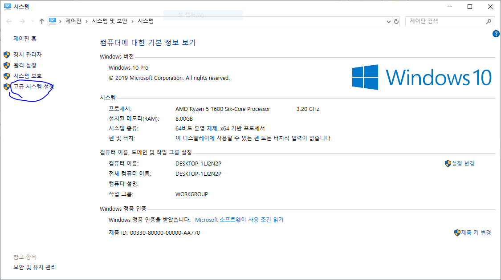

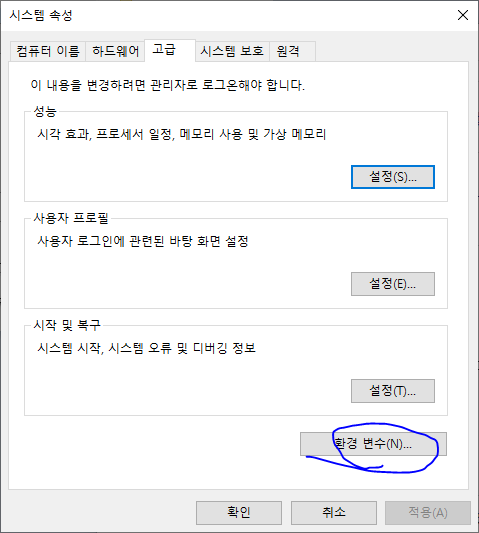

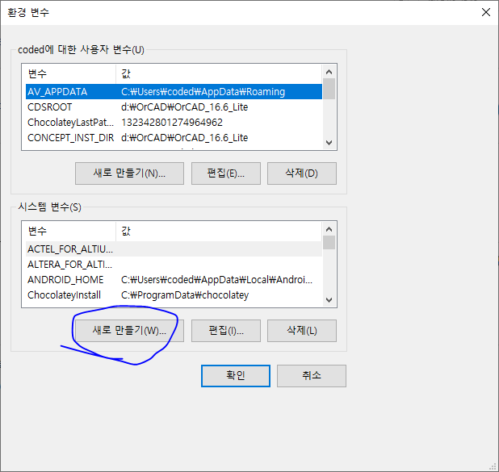

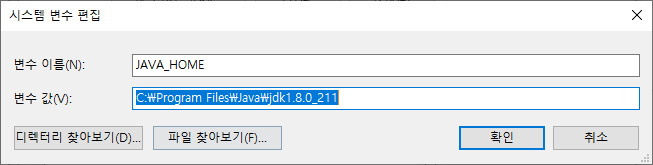

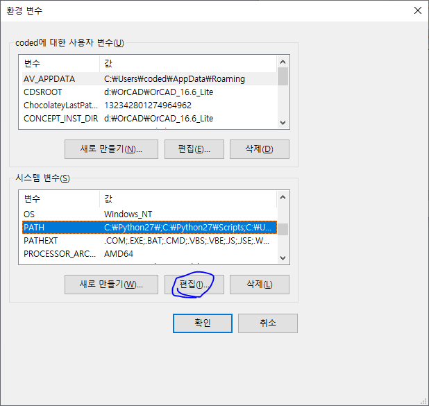

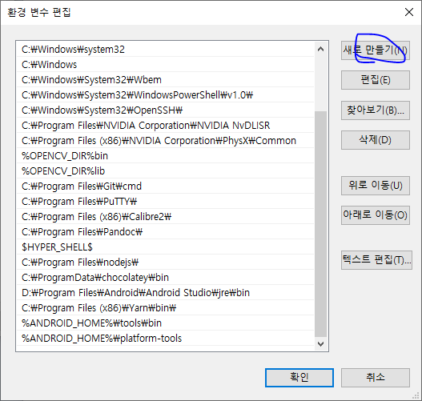

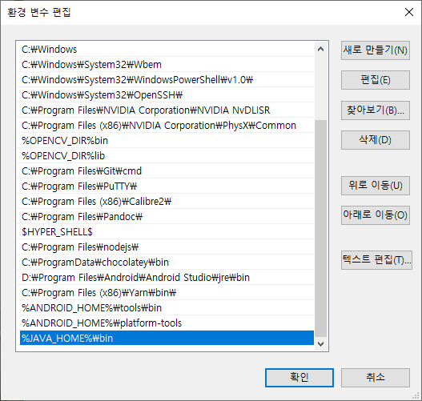

이제 확인을 쭉쭉 눌러서 적용을 시켜 줍니다.


다음으로 안드로이드 스튜디오 설치법을 설명하겠습니다.

[https://developer.android.com/studio/install?hl=ko](https://developer.android.com/studio/install?hl=ko)


위 링크의 가이드를 참고 하여 설치를 하여 줍니다.

그리고 안드로이드 스튜디오를 열고 sdk 설정을 해줍니다.

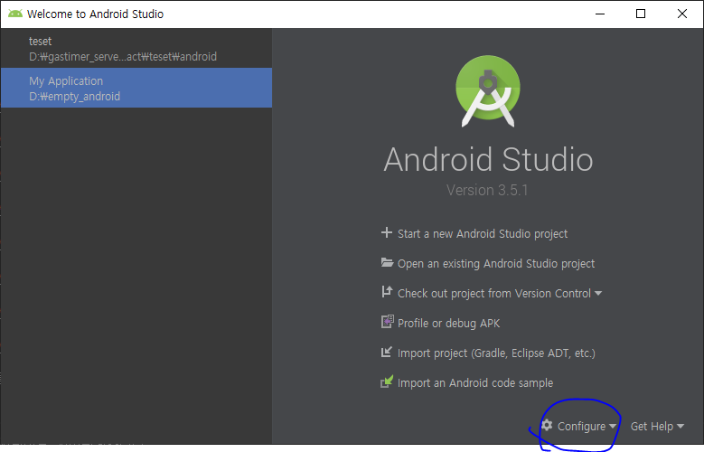

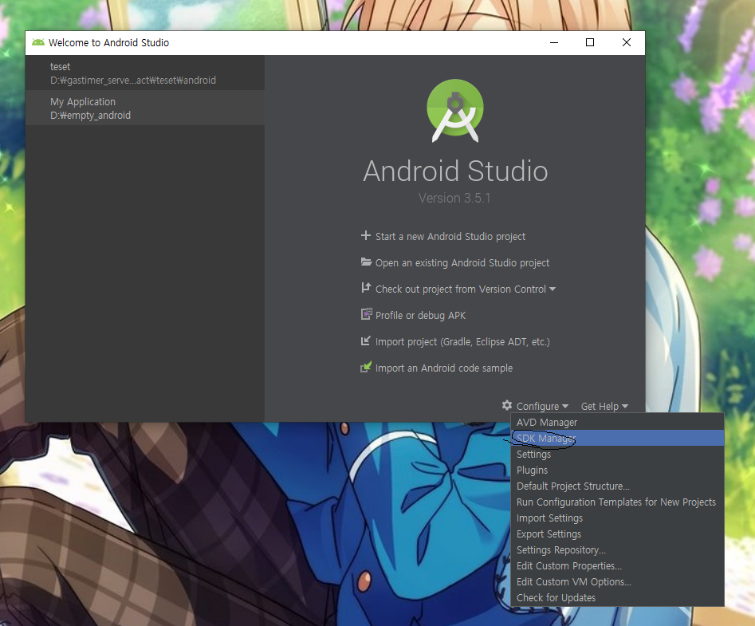

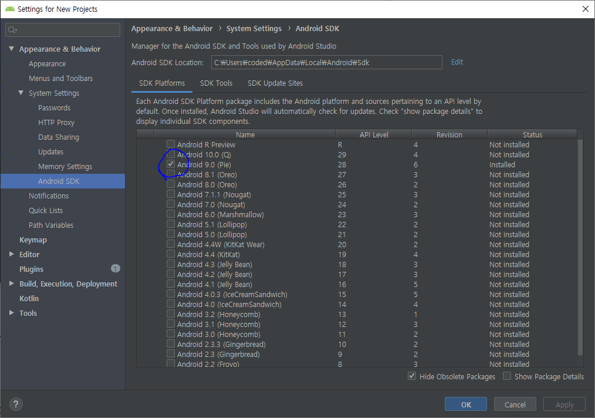

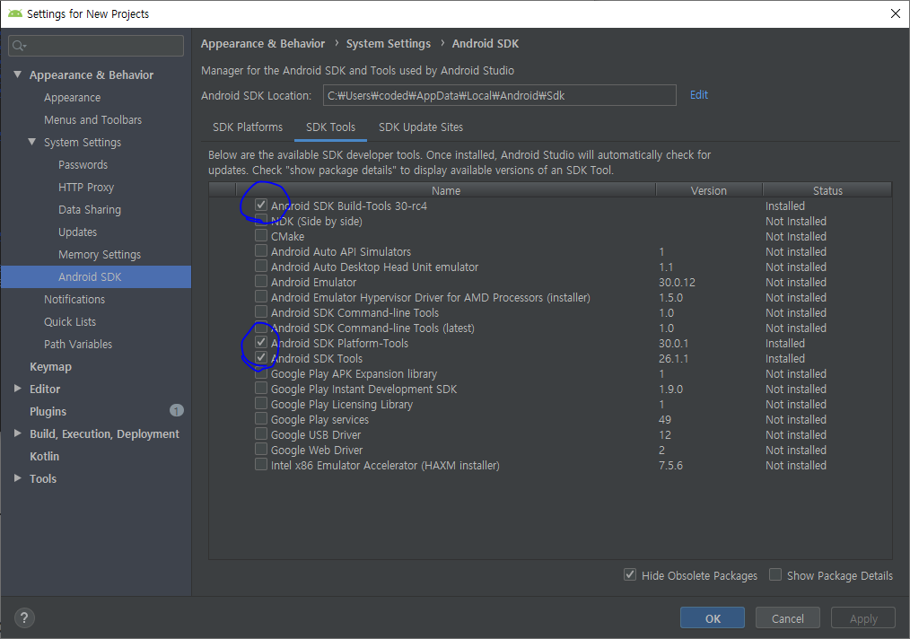

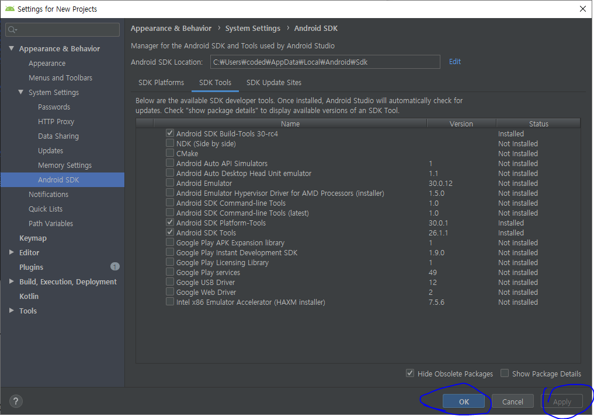

둘중 1나 선택해서 적용해 줍니다.


이후에 안드로이드 환경 변수 설정을 하여 줍니다.

안드로이드 환경변수 설정은 

