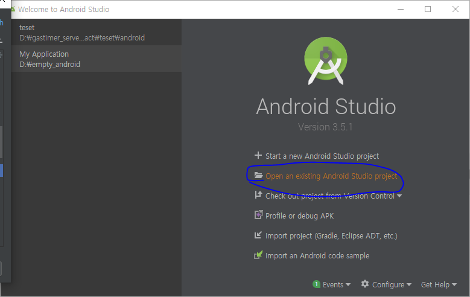
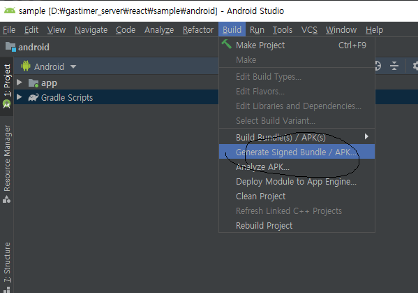

이문서는 react native docs의 environment setup을 참고 하고 있습니다.


우선 react native를 개발하기 위해서는 

JDK8 ,PYTHON2 , node js, android studio , android sdk가 필요합니다.

우선 choco를 인스톨 해줍니다.

cmd를 관리자 권한으로 열어 줍니다.

그리고 다음의 명령어를 입력 합니다.

```
@"%SystemRoot%\System32\WindowsPowerShell\v1.0\powershell.exe" -NoProfile -InputFormat None -ExecutionPolicy Bypass -Command " [System.Net.ServicePointManager]::SecurityProtocol = 3072; iex ((New-Object System.Net.WebClient).DownloadString('https://chocolatey.org/install.ps1'))" && SET "PATH=%PATH%;%ALLUSERSPROFILE%\chocolatey\bin"
```

이후 cmd에 이것을 입력하여 nodejs python2 jdk8를 설치 합니다.

```
choco install -y nodejs.install python2 jdk8
```

그리고 java 환경설정을 해줍니다.


이제 확인을 쭉쭉 눌러서 적용을 시켜 줍니다.


다음으로 안드로이드 스튜디오 설치법을 설명하겠습니다.

[https://developer.android.com/studio/install?hl=ko](https://developer.android.com/studio/install?hl=ko)


위 링크의 가이드를 참고 하여 설치를 하여 줍니다.

그리고 안드로이드 스튜디오를 열고 sdk 설정을 해줍니다.


둘중 1나 선택해서 적용해 줍니다.


이후에 안드로이드sdk 환경 변수 설정을 하여 줍니다.

안드로이드 sdk 환경변수 설정은 


여기에서 안드로이드 sdk위치는 c:\user\(사용자명)\AppData\Local\Android\Sdk입니다.


%ANDROID_HOME%\tools\bin과

%ANDROID_HOME%platform-tools를 path에 추가 합니다.

이제 사전에 필요한 준비는 다 끝났습니다.

이제 원하는 디렉토리에 들어가서 

```shell
npx react-native init 프로젝트명
```

명령어를 실행하여 프로젝트를 생성 합니다.

프로젝트를 생성하면 프로젝트명으로 디렉토리가 생성됨니다.


이제 안드로이드 디바이스를 연결 합니다. (usb 디버깅으로 연결)

또는 안드로이드 스튜디오에서 안드로이드 가상며신을 설정

이제 프로젝트 폴더에서 다음 명령어를 실행 합니다.

```shell
npx react-native run-android
```


이제 샘플이 실행 됩니다.


이제 부터 안드로이드 apk를 뽑는 법을 설명하겠습니다.

안드로이드 스튜디오를 실행합니다.

existing android studio project 를 클릭합니다.



프로젝트 안의 android폴더를 선택 합니다.


몇개의 프로세스가 전부 실행될때 까지 기다림니다.


프로젝트를 make합니다.



generate signed bundle / APK를 선택 합니다.


next를 선택 합니다.


key store를 선택하거나 새로 만듬니다.

기존에 key store가 있다면 하지 안아도 됨니다.


저는 테스트용으로 아무렇게나 생성 하겠습니다. 하지만 앱을 실제 배포하는 경우에는 신중히 적어야 합니다.


키스토어를 입력하고 next를 선택합니다.


다음으로 릴리즈를 선택하고 signature versions을 선택하고 finish를 선택합니다. 이제 그럼 안드로이드 스튜디오에서 빌드를 실행합니다.


빌드가 되고나면 프로젝트경로\android\app\release에 app-release가 생성이 됩니다.